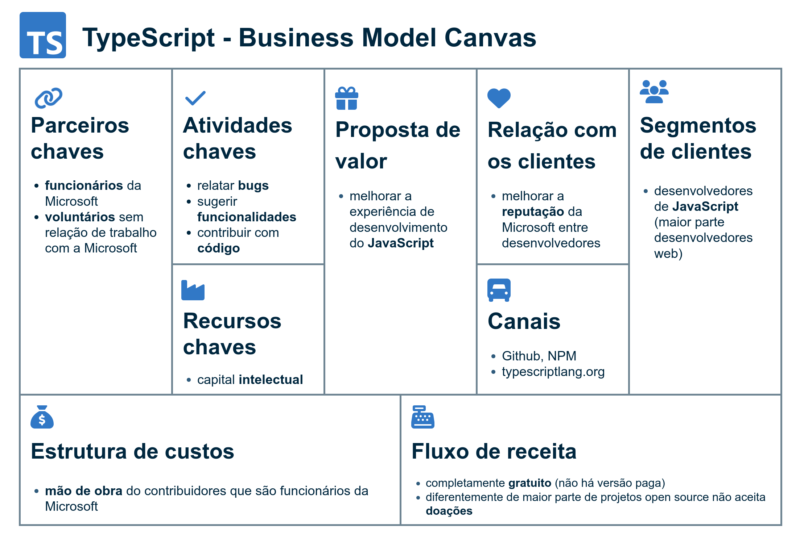

# Modelo de negócio aberto

## Definição

a oferta de valor vem em parte de parceiros/clientes externos a organização; exemplos: marketplace, crowdsourcing

**crowdsourcing** (contribuição colaborativa, em tradução livre) é o processo de obtenção de serviços, ideias ou conteúdo mediante a solicitação de contribuições de um grande grupo disperso de pessoas em vez de usar fornecedores tradicionais ou uma equipe de empregados

## Estudo de caso do projeto open-source TypeScript

### Modelo Canvas

### Regras de negócio

orientações e restrições que ajudam a **regular as operações** de uma empresa

> https://github.com/microsoft/TypeScript/blob/main/CONTRIBUTING.md

1. obedecer o [**código de conduta**](https://opensource.microsoft.com/codeofconduct/)

Para reportar issues:

2. ler o [**FAQ**](https://github.com/Microsoft/TypeScript/wiki/FAQ)
3. procurar por issues **duplicados**
4. não use o issues tracker para fazer **perguntas**
5. **descreva** o seu ambiente e o comportamento do bug
  - what version of TypeScript you're using (run tsc --v)
  - if at all possible, an isolated way to reproduce the behavior
  - the behavior you expect to see, and the actual behavior
6. aceita-se **sugestões** no issues tracker

Para contribuir código:

7. o que você precisa ter **antes de começar**
  - a bug or feature you want to work on
  - a GitHub account
  - a copy of the TypeScript code
  - Node, which runs JavaScript locally (current or LTS will both work)
  - an editor. VS Code is the best place to start for TypeScript
  - the hereby command line tool, for building and testing changes
8. ler as seções de **ajuda** (Get Started, Helpful tasks, Tips)
9. contribuições somente serão aceitas quando tiverem sido **aprovadas** — etiqueta [help wanted](https://github.com/Microsoft/TypeScript/issues?q=is%3Aopen+is%3Aissue+label%3A%22help+wanted%22) ou no [backlog](https://github.com/microsoft/TypeScript/milestone/29)
10. contribuições de novas funcionalidades somente serão aceitas se as necessidades que elas buscam sanar ainda não são satisfeitas adequadamente por **ferramentas externas** e estão em acordância com os [design goals do TypeScript](https://github.com/Microsoft/TypeScript/wiki/TypeScript-Design-Goals)
11. concodar com o **Contributor License Agreement**
	- upon submitting a pull request, you will automatically be given instructions on how to sign the CLA
12. obedecer as regras para **pull request**
  - include a description of what your change intends to do
  - be based on reasonably recent commit in the main branch
  - include adequate tests
  - at least one test should fail in the absence of your non-test code changes. If your PR does not match this criteria, please specify why
  - tests should include reasonable permutations of the target fix/change
  - include baseline changes with your change
  - follow the code conventions described in Coding guidelines
  - to avoid line ending issues, set autocrlf = input and whitespace = cr-at-eol in your git configuration
13. adicionar **testes** para demonstrar o que foi feito
